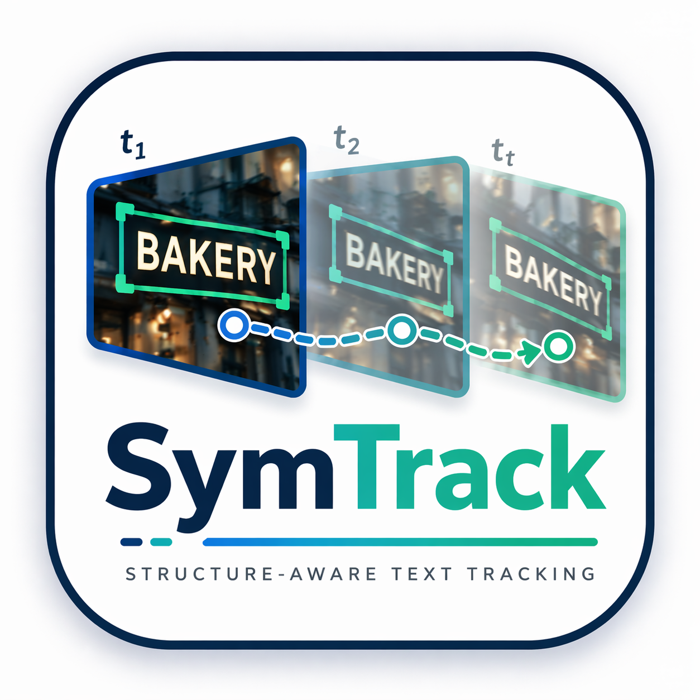
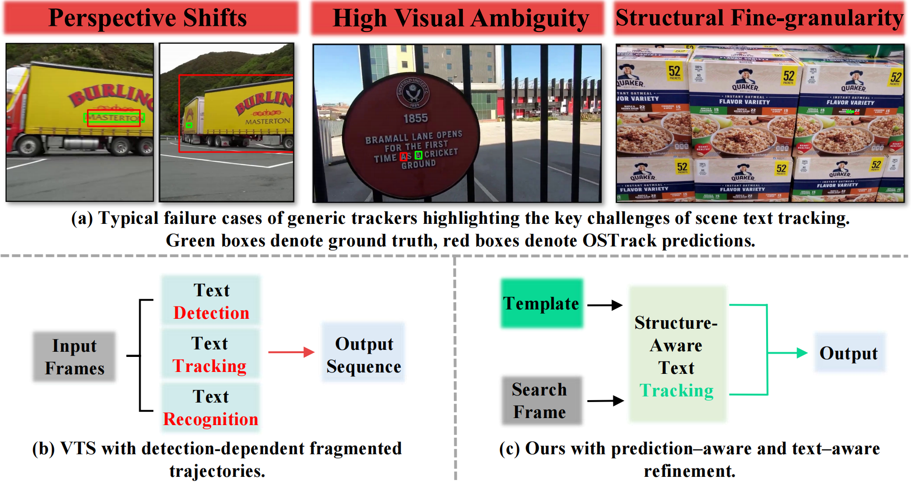

# SymTrack

<div align="center">

  

  <h2>Beyond Detection: A Structure-Aware Framework for Scene Text Tracking</h2>

  <p>
    <b>Official implementation of SymTrack, accepted by ICML 2026.</b>
  </p>

  <p>
  <a href="https://EdisonYCM.github.io/SymTrack/">
    
  </a>
  <a href="https://github.com/EdisonYCM/SymTrack">
    
  </a>
  <!-- <a href="https://arxiv.org/abs/XXXX.XXXXX">
    
  </a>
  <a href="Chinese_version.pdf">
    
  </a> -->
  <a href="https://huggingface.co/EdisonYCM/SymTrack">
    
  </a>
  <a href="https://www.modelscope.cn/">
    
  </a>
  <a href="https://drive.google.com/drive/folders/1HmathXplBBh0kLqo8NQVy1scQYKeh96D?usp=drive_link">
    
  </a>
</p>

</div>

## News

- **[2026-05-01]** Code, models, and benchmarks will be released.
- **[2026-05-01]** SymTrack is accepted by **ICML 2026**.

## Overview

Scene text tracking aims to localize a specified text instance across video frames. Unlike generic visual object tracking, scene text tracking is uniquely challenging because text instances are highly sensitive to geometric deformation, semantic ambiguity, and fine-grained structural changes.

**SymTrack** is a detection-free scene text tracking framework designed specifically for robust video text tracking. It avoids repeated per-frame detection and instead tracks a target text instance from an initial annotation. SymTrack integrates text-specific structural priors into a unified tracking framework and improves robustness under perspective shifts, dense distractors, and low-quality visual conditions.

## Motivation

<p align="center">
  
</p>

Modern single object trackers perform well on generic visual targets, but they are not designed for scene text. Scene text has several properties that make direct application of generic trackers unreliable:

1. **Perspective-induced distortion.**  
   Text is usually printed or displayed on planar surfaces. Camera motion and viewpoint changes can cause strong geometric deformation and feature misalignment.

2. **High visual ambiguity.**  
   Different text instances often share similar colors, fonts, strokes, and layouts. Generic trackers can easily drift to nearby distractors.

3. **Fine-grained structural sensitivity.**  
   Small localization errors may change the perceived textual content. Text tracking therefore requires higher structural precision than common object tracking.

SymTrack is built around these observations and introduces a structure-aware tracking paradigm for scene text.

## Contributions

- We provide systematic analysis of STT, identifying core challenges including **severe distortions from perspective shifts**, **high visual ambiguity across instances**, and **fine-grained structural sensitivity**.
- We propose **SymTrack**, a unified architecture equipped with PTR, CEC and AIE, which respectively alleviate structural imbalance, semantic bias, and motion limitation problems of existing trackers.
- Considering the lack of dedicated STT benchmarks, we build upon three datasets from VTS and ensure high-quality annotations. On these benchmarks, our proposed SymTrack sets the new **state-of-the-art** performance.

## Method

<p align="center">
  
</p>

## Benchmark Results

| Type | Method | Venue | ArTVideo<sub>SOT</sub> AUC (%) | ArTVideo<sub>SOT</sub> P<sub>Norm</sub> (%) | ArTVideo<sub>SOT</sub> P (%) | DSText<sub>SOT</sub> AUC (%) | DSText<sub>SOT</sub> P<sub>Norm</sub> (%) | DSText<sub>SOT</sub> P (%) | BOVText<sub>SOT</sub> AUC (%) | BOVText<sub>SOT</sub> P<sub>Norm</sub> (%) | BOVText<sub>SOT</sub> P (%) |
|:--:|:--|:--:|--:|--:|--:|--:|--:|--:|--:|--:|--:|
| Vision-only | SiamRPN++ | CVPR2019 | 56.40 | 67.30 | 71.90 | 44.40 | 54.40 | 63.20 | 58.70 | 71.50 | 65.50 |
| Vision-only | STARK | ICCV2021 | 70.37 | 83.48 | 86.84 | 57.59 | 68.63 | 78.01 | 61.92 | 75.16 | 76.33 |
| Vision-only | OSTrack<sub>256</sub> | ECCV2022 | 64.86 | 77.95 | 81.99 | 52.50 | 63.49 | 70.83 | 58.67 | 73.04 | 74.03 |
| Vision-only | OSTrack<sub>384</sub> | ECCV2022 | 64.80 | 77.82 | 82.05 | 54.83 | 66.51 | 74.44 | 59.18 | 72.68 | 73.30 |
| Vision-only | AiATrack | ECCV2022 | 66.41 | 77.96 | 81.77 | 57.92 | 68.12 | 79.02 | 64.16 | 75.07 | 73.42 |
| Vision-only | SeqTrack<sub>L384</sub> | CVPR2023 | 64.35 | 76.46 | 80.92 | 54.63 | 65.81 | 74.19 | 60.42 | 76.18 | 76.70 |
| Vision-only | ARTrack<sub>256</sub> | CVPR2023 | 64.85 | 78.81 | 79.53 | 48.53 | 56.12 | 65.20 | 62.75 | 72.28 | 73.01 |
| Vision-only | GRM<sub>256</sub> | CVPR2023 | 68.22 | 79.84 | 83.30 | 53.05 | 63.87 | 71.04 | 59.59 | 72.12 | 72.82 |
| Vision-only | GRM<sub>384</sub> | CVPR2023 | 68.47 | 80.65 | 83.64 | 55.51 | 66.07 | 74.63 | 59.13 | 71.02 | 71.66 |
| Vision-only | ROMTrack | ICCV2023 | 70.62 | 83.32 | 87.13 | 56.82 | 68.79 | 75.61 | 62.82 | 73.74 | 74.90 |
| Vision-only | ODTrack | AAAI2024 | 69.81 | 83.54 | 86.68 | 62.71 | 75.84 | 84.26 | 64.74 | 77.74 | 78.45 |
| **Ours** | **SymTrack** | **ICML2026** | **77.74** | **91.29** | **95.88** | **70.66** | **83.61** | **91.83** | **77.06** | **90.05** | **90.18** |
| V-L | DUTrack<sub>256</sub> | CVPR2025 | 68.73 | 82.46 | 86.87 | 60.57 | 72.77 | 81.31 | <u>65.09</u> | 78.98 | 79.04 |
| V-L | DUTrack<sub>384</sub> | CVPR2025 | <u>72.09</u> | <u>85.97</u> | <u>89.36</u> | <u>63.63</u> | <u>76.72</u> | <u>85.00</u> | 65.08 | <u>79.41</u> | <u>79.30</u> |
| VTS | TransVTSpotter | NeurIPS2021 | 8.84 | 78.11 | 38.07 | 4.93 | 75.21 | 67.80 | - | - | - |
| VTS | TransDETR | IJCV2024 | 9.18 | 78.75 | 43.31 | 5.08 | 76.09 | 69.79 | - | - | - |

## Visualization

<p align="center">
  
</p>

<p align="center">
  
</p>

## Model

Expected model files after preparation:

```text
${PROJECT_ROOT}
|-- output
|   |-- checkpoints
|   |   |-- train
|   |   |   |-- symtrack
|   |   |   |   |-- baseline_text_scalear
|   |   |   |   |   |-- SymTrack_ep0300.pth.tar
|-- my_internvit_clean
|-- pretrained_networks
|   |-- mae_pretrain_vit_base.pth
```

## Installation

### 1. Clone this repository

```
git clone https://github.com/EdisonYCM/SymTrack.git
cd SymTrack
```

### 2. Create environment

```
conda create -n symtrack python=3.9 -y
conda activate symtrack
```

### 3. Install dependencies

```
pip install -U pip
pip install -r requirements.txt
```

## Data Preparation

Download the SymTrack benchmark from ModelScope:

The expected dataset structure is:

```
${PROJECT_ROOT}
|-- data
|   |-- ArTVideo_SOT_Train
|   |   |-- train
|   |   |   |-- list.txt
|   |   |   |-- sequence_1
|   |   |   |   |-- groundtruth.txt
|   |   |   |   |-- 00000001.jpg
|   |   |   |   |-- ...
|   |   |-- val
|   |   |   |-- list.txt
|   |   |   |-- ...
|   |
|   |-- ArTVideo_SOT_Test
|   |   |-- list.txt
|   |   |-- sequence_1
|   |   |   |-- groundtruth.txt
|   |   |   |-- 00000001.jpg
|   |   |   |-- ...
|   |
|   |-- DSText_SOT_Train
|   |-- DSText_SOT_Test
|   |-- BOVText_SOT_Train
|   |-- BOVText_SOT_Test
```

Each sequence folder should contain:

```
sequence_name
|-- groundtruth.txt
|-- 00000001.jpg
|-- 00000002.jpg
|-- ...
```

The annotation file `groundtruth.txt` follows the standard SOT format:

```
x,y,w,h
```

## Download Checkpoints

### Option 1: HuggingFace

```
pip install -U huggingface_hub
hf download EdisonYCM/SymTrack --local-dir ./hf_assets
```

### Option 2: Google Drive

Download the model files from:

```
https://drive.google.com/drive/folders/1HmathXplBBh0kLqo8NQVy1scQYKeh96D?usp=drive_link
```

Then organize them as:

```
${PROJECT_ROOT}
|-- output/checkpoints/train/symtrack/baseline_text_scalear
|-- my_internvit_clean
|-- pretrained_networks
```

## Set Project Paths

Run:

```
python tracking/create_default_local_file.py \
  --workspace_dir . \
  --data_dir ./data \
  --save_dir ./output
```

This command generates local path configuration files for training and testing.

Then edit the following files if needed:

```
lib/train/admin/local.py
lib/test/evaluation/local.py
```

## Evaluation

```
python tracking/test.py symtrack baseline_text_scalear \
  --dataset_name XXX \
  --runid 300 \
  --threads 8 \
  --num_gpus 1
```

The results will be saved under:

```
output/test/tracking_results/
```

## Analyze Results

```
python tracking/analysis_results.py
```

## Training

```
python tracking/train.py \
  --script symtrack \
  --config baseline_text_scalear \
  --save_dir ./output \
  --mode multiple \
  --nproc_per_node 4 \
```

## Test FLOPs and Speed

```
python tracking/profile_model.py --config baseline_text_scalear
```

------

## Citation

If this project is useful for your research, please consider citing:

```
@inproceedings{yu2026symtrack,
  title={Beyond Detection: A Structure-Aware Framework for Scene Text Tracking},
  author={Yu, Chenmin and Yu, Liu and Wu, Daiqing and Li, Gengluo and Chen, Zeyu and Zhou, Yu},
  booktitle={Proceedings of the 43rd International Conference on Machine Learning},
  year={2026}
}
```

## Acknowledgements

This repository is built upon excellent open-source tracking frameworks and codebases. We sincerely thank the authors of:

- [STARK](https://github.com/researchmm/Stark)
- [OSTrack](https://github.com/botaoye/OSTrack)
- [ODTrack](https://github.com/GXNU-ZhongLab/ODTrack)
- [PyTracking](https://github.com/visionml/pytracking)

We also thank the maintainers of the video text spotting datasets used to construct the scene text tracking benchmarks.

## License

Licensed under a [Creative Commons Attribution-NonCommercial 4.0 International](https://creativecommons.org/licenses/by-nc/4.0/) for Non-commercial use only.
Any commercial use should get formal permission first.
